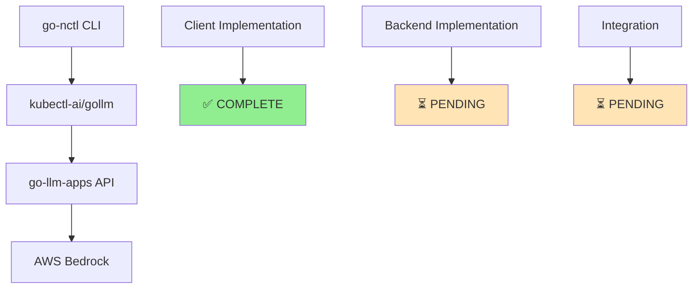
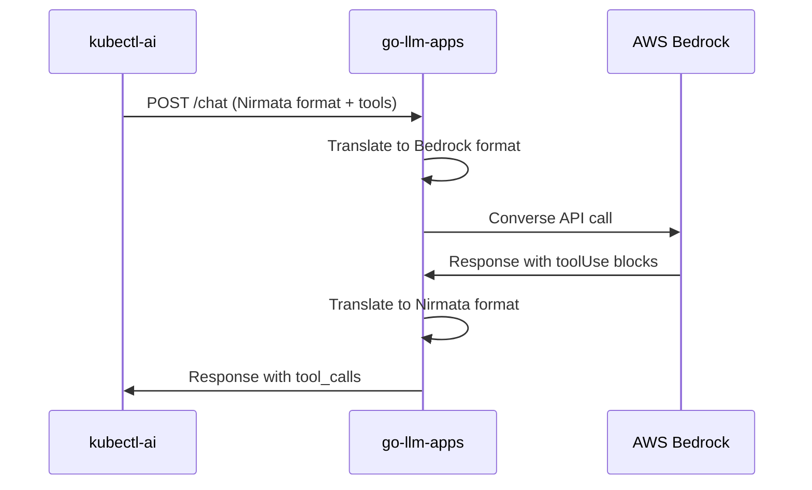

# Nirmata Provider Tool Calling Design Document

## Overview

This document outlines the design for implementing tool/function calling support in the Nirmata provider within the kubectl-ai/gollm library. The goal is to achieve feature parity with the existing Bedrock provider, enabling consistent behavior across different LLM backends.

## Problem Statement

Currently, the Nirmata provider lacks tool calling support while the Bedrock provider has full implementation. This causes:

- **Inconsistent Agent Behavior**: PAC (Policy as Code) agents behave differently between providers
- **Degraded Functionality**: Nirmata falls back to prompt engineering instead of structured tool execution
- **User Experience Issues**: Different outputs and capabilities depending on provider choice

## Architecture Overview



## Implementation Status

| Component | Status | Description |
|-----------|--------|-------------|
| **kubectl-ai/gollm** | ✅ **Complete** | Client-side tool calling implementation |
| **go-llm-apps** | ⏳ **Pending** | Backend API translation layer |
| **go-nctl** | ⏳ **Pending** | CLI integration and fallback handling |

## Design Components

### 1. Client Implementation (kubectl-ai/gollm) - COMPLETED

The client-side implementation is already complete and includes:

#### Key Features
- ✅ Tool registration via `SetFunctionDefinitions()`
- ✅ Tool inclusion in API requests
- ✅ Response parsing with `AsFunctionCalls()`
- ✅ Tool result handling with `FunctionCallResult`
- ✅ Streaming support ready

#### Request Format
```json
{
  "model": "us.anthropic.claude-sonnet-4-20250514-v1:0",
  "messages": [...],
  "tools": [
    {
      "name": "save_policy",
      "description": "Save a policy to a file",
      "parameters": {
        "type": "object",
        "properties": {...},
        "required": [...]
      }
    }
  ],
  "tool_choice": "auto"
}
```

#### Expected Response Format
```json
{
  "message": "I'll save the policy for you.",
  "tool_calls": [
    {
      "id": "call_abc123",
      "type": "function",
      "function": {
        "name": "save_policy",
        "arguments": "{\"filename\": \"policy.yaml\", \"content\": \"...\"}"
      }
    }
  ]
}
```

### 2. Backend Implementation (go-llm-apps) - REQUIRED

The backend must implement a translation layer between the Nirmata API format and AWS Bedrock's native format.

#### 2.1 Translation Architecture



#### 2.2 Core Translation Functions

**Request Translation (Nirmata → Bedrock)**
- Convert `tools` array to Bedrock `toolConfig`
- Map `tool_choice` to Bedrock tool choice format
- Handle `role: "tool"` messages as `toolResult` blocks

**Response Translation (Bedrock → Nirmata)**
- Extract `toolUse` blocks from Bedrock responses
- Convert to `tool_calls` array format
- Preserve text content alongside tool calls

#### 2.3 Streaming Support

**Streaming Format (JSONL)**
```jsonl
{"type": "content", "delta": "Analyzing your request..."}
{"type": "tool_call", "index": 0, "delta": {"id": "call_abc", "type": "function", "function": {"name": "save_policy"}}}
{"type": "tool_call", "index": 0, "delta": {"function": {"arguments": "{\"filename\":\"policy.yaml\"}"}}}
{"type": "done"}
```

#### 2.4 API Endpoints

**Enhanced Chat Endpoint**
```
POST /llm-apps/chat
Content-Type: application/json

Query Parameters:
- stream=true (for streaming responses)
```

**Capabilities Endpoint (Recommended)**
```
GET /llm-apps/capabilities

Response:
{
  "tools_supported": true,
  "tool_types": ["function"],
  "streaming_tools": true,
  "max_tools": 128
}
```

### 3. Integration Layer (go-nctl) - PENDING

#### 3.1 Provider Detection
```go
func setNirmataProviderEnvs() error {
    // Set authentication
    os.Setenv("NIRMATA_APIKEY", token)
    os.Setenv("NIRMATA_ENDPOINT", endpoint)
    
    // Check tool support
    toolsEnabled := checkNirmataToolSupport()
    os.Setenv("NIRMATA_TOOLS_ENABLED", toolsEnabled)
    
    return nil
}
```

#### 3.2 Fallback Handling
When tools are not supported, the system gracefully falls back to prompt-based generation:

```go
if c.provider == "nirmata" && os.Getenv("NIRMATA_TOOLS_ENABLED") != "true" {
    systemPromptTemplate = systemPromptTemplateFallback
} else {
    systemPromptTemplate = systemPromptTemplateNormal
}
```

## Critical Implementation Requirements

### For go-llm-apps Team

#### 1. **CRITICAL: Tool Call Reception** ⚠️
- Parse Bedrock `toolUse` blocks from responses
- Convert to Nirmata `tool_calls` format
- **This is the #1 blocker** - without this, tools don't work at all

#### 2. **CRITICAL: Tool Result Handling** ⚠️
- Accept messages with `role: "tool"` and `tool_call_id`
- Convert to Bedrock `toolResult` format
- Map `tool_call_id` → `toolUseId`

#### 3. **IMPORTANT: Streaming Support**
- Emit tool call events in JSONL format during streaming
- Don't skip tool events - forward them to client
- Handle incremental tool argument building

#### 4. **RECOMMENDED: Capabilities Endpoint**
- Allow clients to detect tool support before attempting to use
- Simple GET endpoint returning feature flags
- Enables graceful degradation

## Implementation Timeline

### Phase 1: Core Tool Support (Week 1)
- [ ] Implement request/response translation
- [ ] Add tool call parsing from Bedrock
- [ ] Handle tool results in conversation flow
- [ ] Basic non-streaming tool support

### Phase 2: Streaming & Polish (Week 2)
- [ ] Add streaming tool call support
- [ ] Implement capabilities endpoint
- [ ] Error handling and edge cases
- [ ] Performance optimization

### Phase 3: Integration & Testing (Week 3)
- [ ] Update go-nctl integration
- [ ] End-to-end testing
- [ ] Documentation updates
- [ ] Production deployment

## Testing Strategy

### Unit Tests
- Request/response translation functions
- Tool call parsing and formatting
- Error handling scenarios

### Integration Tests
```bash
# Test 1: Basic tool calling
curl -X POST $NIRMATA_ENDPOINT/llm-apps/chat \
  -d '{"messages": [...], "tools": [...]}'

# Test 2: Tool result handling
curl -X POST $NIRMATA_ENDPOINT/llm-apps/chat \
  -d '{"messages": [..., {"role": "tool", "tool_call_id": "...", "content": "..."}]}'

# Test 3: Streaming with tools
curl -X POST "$NIRMATA_ENDPOINT/llm-apps/chat?stream=true" \
  -d '{"messages": [...], "tools": [...]}'
```

### End-to-End Tests
```bash
# PAC agent with Nirmata vs Bedrock comparison
./nctl ai --provider nirmata --prompt "generate a policy that requires pod labels"
./nctl ai --provider bedrock --prompt "generate a policy that requires pod labels"
```

## Success Criteria

The implementation will be considered successful when:

1. ✅ **Tool Registration**: Clients can send tools in requests
2. ✅ **Tool Execution**: Backend returns `tool_calls` in responses
3. ✅ **Tool Results**: Tool results are properly forwarded and processed
4. ✅ **Streaming**: Tool calls work in streaming mode
5. ✅ **Consistency**: PAC agent behaves identically on Nirmata and Bedrock
6. ✅ **Graceful Degradation**: System falls back gracefully when tools unavailable

## Risk Mitigation

| Risk | Impact | Mitigation |
|------|---------|------------|
| **Backend Incompatibility** | High | Environment variable override + graceful fallback |
| **Breaking Changes** | Medium | Backward compatible implementation |
| **Performance Impact** | Low | Single-pass translation, no extra API calls |
| **Complex Tool Interactions** | Medium | Reuse proven Bedrock provider patterns |

## Dependencies

### External Dependencies
- AWS Bedrock API (existing)
- Nirmata authentication system (existing)

### Internal Dependencies
- kubectl-ai/gollm tool calling interfaces (✅ complete)
- go-llm-apps HTTP API framework (existing)
- go-nctl agent framework (existing)

## Monitoring & Observability

### Key Metrics
- Tool call success rate
- Request/response translation latency
- Tool execution error rates
- Fallback activation frequency

### Logging Points
- Tool registration attempts
- Translation layer operations
- Bedrock API interactions
- Error conditions and fallbacks

## Security Considerations

- **No Additional Attack Surface**: Uses existing authentication
- **Input Validation**: Tool parameters validated through existing JSON schema
- **Output Sanitization**: Tool results processed through standard response pipeline
- **Rate Limiting**: Inherits existing API rate limits

## Future Enhancements

### Potential Improvements
- **Tool Discovery**: Dynamic tool registration from external sources
- **Tool Composition**: Chaining multiple tools in single requests
- **Enhanced Streaming**: Real-time tool execution progress
- **Caching**: Tool result caching for repeated operations

### Extension Points
- **Custom Tool Types**: Beyond function calling
- **Provider Abstraction**: Unified tool interface across all providers
- **Tool Marketplace**: Pluggable tool ecosystem

## Conclusion

This design provides a comprehensive path to achieving tool calling parity between Nirmata and Bedrock providers. The client implementation is complete and ready, requiring only the backend translation layer to enable full functionality.

The phased approach ensures minimal risk while delivering immediate value once core functionality is implemented. The design maintains backward compatibility and provides graceful degradation for environments that don't yet support tools.

---

**Contact Information:**
- **Client Implementation**: See kubectl-ai/gollm codebase (complete)
- **Backend Requirements**: This document + go-llm-apps team
- **Integration Questions**: go-nctl team

**Next Steps:**
1. Review and approve this design
2. Begin Phase 1 implementation in go-llm-apps
3. Coordinate testing across all repositories