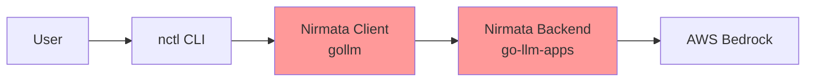

# Complete Analysis: Bedrock Streaming Tool Call Failures

## Executive Summary

The Nirmata provider's tool calling functionality is **completely broken** due to a cascade of architectural mismatches and silent failures. While the JSONL formatting has been fixed, **five critical issues** prevent any tool from executing when using the Nirmata backend as a proxy to Bedrock.

## Architecture Overview



**Red components have critical issues preventing tool execution.**

## The Complete Tool Call Flow (and Where It Breaks)

### 1. User Initiates Request
```bash
nctl ai --provider nirmata --prompt "list files in current directory"
```

### 2. CLI Creates Nirmata Client
- ✅ Authentication tokens set correctly
- ✅ Endpoint configured
- ❌ **PROBLEM**: Client forces `provider=bedrock` parameter (Issue #4)

### 3. Client Sends Request to Backend
```go
// nirmata.go:350-351
q.Set("chunked", "true")
q.Set("provider", "bedrock")  // <-- Forces bedrock, even for Nirmata provider!
```

### 4. Backend Receives Request
- ✅ JSONL formatting now correct (fixed in v0.0.24)
- ✅ Streaming infrastructure works
- ❌ **PROBLEM**: Backend must have AWS credentials due to forced provider

### 5. Backend Calls Bedrock
```go
// Backend creates its own Bedrock client and streams response
stream, err := c.llmChat.SendStreaming(ctx, contents...)
```

### 6. Bedrock Returns Tool Calls
Bedrock sends tool calls as streaming events:
```go
// bedrock.go:333-345
case *types.ConverseStreamOutputMemberContentBlockStart:
    if toolStart, ok := v.Value.Start.(*types.ContentBlockStartMemberToolUse); ok {
        // Tool call detected
    }
```

### 7. Backend Processes Stream ❌ **CRITICAL FAILURE POINT**

```go
// conversation.go:174-178
if calls, ok := part.AsFunctionCalls(); ok && len(calls) > 0 {
    functionCalls = append(functionCalls, calls...)
    // ❌ ISSUE #3: NO LISTENER NOTIFICATION HERE!
    // Tool calls are collected but NOT forwarded to client
}
```

**The backend collects tool calls but doesn't forward them to the client immediately!**

### 8. Backend Executes Tools Locally
```go
// conversation.go:403
// When backend executes tool, it sends wrong format:
c.listener(ctx, StreamDataTypeToolStart, c.ID().String(), toolDescription)
// ❌ ISSUE #1: Sends plain string like "bash: ls -la"
```

### 9. Client Receives Malformed Event
```go
// nirmata.go:448-451
var toolData struct {
    ToolCall nirmataToolCall `json:"tool_call"`
}
if err := json.Unmarshal([]byte(streamData.Data), &toolData); err == nil {
    // This ALWAYS fails because streamData.Data is plain text, not JSON
} else {
    klog.V(2).Infof("Failed to parse tool call from stream: %v", err)
    // ❌ ISSUE #2: Error logged at debug level only - user never sees it
}
```

### 10. Silent Failure - No Tool Execution
- Client can't parse the tool event
- Error is logged at debug level (invisible)
- Tool call is silently dropped
- User sees no output, no error

## The Five Critical Issues

### Issue #1: Data Contract Violation
**Location**: `go-llm-apps/pkg/agent/conversation.go:403`
- **Sends**: Plain string `"bash: ls -la"`
- **Expects**: JSON `{"tool_call": {"id": "...", "type": "function", "function": {...}}}`
- **Impact**: 100% parse failure rate

### Issue #2: Silent Error Handling
**Location**: `kubectl-ai/gollm/nirmata.go:468`
- Parse failures logged at `klog.V(2)` (debug level)
- Users run without `-v=2` flag
- **Impact**: Problems are invisible to users

### Issue #3: Missing Tool Call Forwarding
**Location**: `go-llm-apps/pkg/agent/conversation.go:174-178`
- LLM tool calls are collected but not sent to client
- Only locally executed tools trigger events
- **Impact**: Client never knows LLM wants to use tools

### Issue #4: Forced Provider Routing
**Location**: `kubectl-ai/gollm/nirmata.go:351`
- Client hardcodes `provider=bedrock` in URL
- Forces backend to use Bedrock regardless of configuration
- **Impact**: Unnecessary complexity, dual authentication required

### Issue #5: Arguments Parsing Failures
**Location**: `kubectl-ai/gollm/nirmata.go:783-785`
- Argument parse errors logged at debug level
- Returns empty arguments on failure
- **Impact**: Tools execute with missing parameters

## The Cascading Failure Chain

```
1. User requests tool execution
   ↓
2. Client forces bedrock provider (Issue #4)
   ↓
3. Backend calls Bedrock successfully
   ↓
4. Bedrock returns tool calls
   ↓
5. Backend doesn't forward tool calls to client (Issue #3)
   ↓
6. Backend tries to execute tool locally
   ↓
7. Backend sends wrong format to client (Issue #1)
   ↓
8. Client fails to parse silently (Issue #2)
   ↓
9. Tool arguments lost (Issue #5)
   ↓
10. COMPLETE FAILURE - No tools execute, no error shown
```

## Root Architectural Problems

### 1. **Implicit Contract Assumptions**
The backend and client have different, undocumented expectations for the `StreamDataTypeToolStart` event data format.

### 2. **Missing Integration Tests**
No end-to-end tests validate the tool calling flow through the Nirmata provider.

### 3. **Provider Abstraction Leak**
The Nirmata client shouldn't know or care about Bedrock - but it forces `provider=bedrock`.

### 4. **Error Visibility Philosophy**
Critical failures are logged at debug level, following a "fail silently" pattern that makes debugging impossible.

### 5. **Dual Tool Execution Models**
The system conflates two different models:
- **Model A**: LLM decides to call tools (Bedrock's approach)
- **Model B**: Backend decides to call tools (conversation.go's approach)

These models have different event flows but share the same event types, causing confusion.

## Why It Works with Direct Bedrock

When using `--provider bedrock` directly:
1. No backend proxy involved
2. Client talks directly to AWS Bedrock
3. Tool calls parsed from Bedrock's format correctly
4. No data transformation mismatches
5. Errors properly propagated

## Business Impact

1. **Feature Completely Broken**: Tool calling doesn't work at all via Nirmata
2. **User Experience**: Silent failures with no error messages
3. **Support Burden**: Impossible to debug without source code access
4. **Trust**: Users lose confidence when features fail mysteriously

## Required Fixes Summary

### Immediate (P0)
1. Fix data format mismatch (Issue #1)
2. Forward LLM tool calls to client (Issue #3)
3. Make errors visible (Issue #2)

### Short-term (P1)
4. Remove forced provider parameter (Issue #4)
5. Fix argument parsing (Issue #5)

### Long-term (P2)
6. Add integration tests for tool calling
7. Document the streaming event contract
8. Separate LLM tool calls from backend tool execution

## Testing Requirements

### Unit Tests Needed
- Tool event JSON formatting
- Parse error handling
- Argument marshaling/unmarshaling

### Integration Tests Needed
- End-to-end tool calling via Nirmata provider
- Error propagation validation
- Multiple tool execution in sequence

### Manual Test Cases
1. Simple tool: `"list files"`
2. Tool with args: `"create file test.txt"`
3. Multiple tools: `"create dir, list, remove"`
4. Invalid tool: `"call nonexistent tool"`
5. Malformed response handling

## Conclusion

The tool calling feature is architecturally broken due to mismatched contracts between components and a philosophy of silent failure. The fixes are straightforward but require changes in both the backend (go-llm-apps) and client (kubectl-ai/gollm) repositories. Until fixed, users must use `--provider bedrock` directly to bypass the broken Nirmata proxy layer.